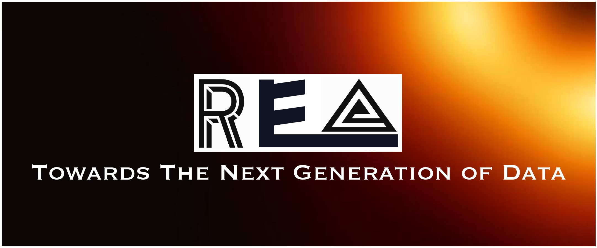
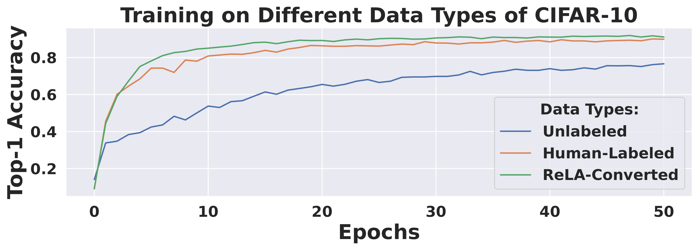
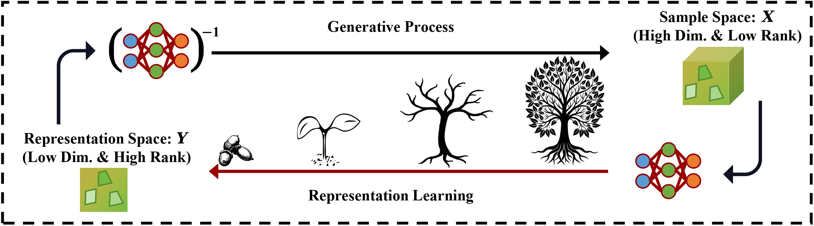
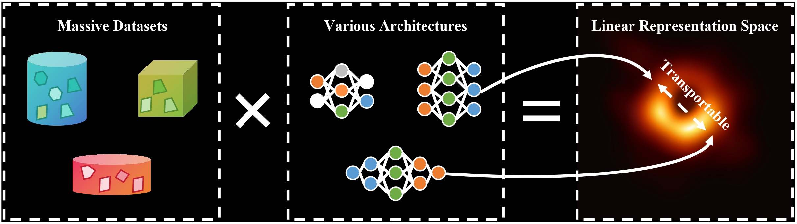
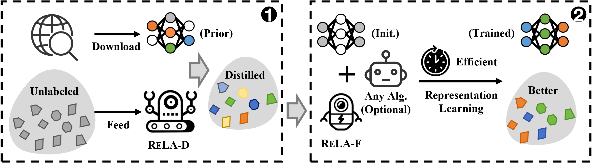

<p align="center">

</p>

<div align="center">
  <a href="https://sp12138.github.io/">Peng Sun :man_artist:</a>, Yi Jiang :man_student:, <a href="https://tlin-taolin.github.io/">Tao Lin :skier:</a>

  <a href="https://arxiv.org/abs/2405.14669">[arXiv] :page_facing_up:</a> | <a href="#bibliography">[BibTeX] :label:</a>
</div>


## Why need ReLA (a data converter)?
Data, the cornerstone of modern deep learning, is proliferating rapidly in contemporary society, presenting two fundamental challenges:

- Leveraging unlabeled data directly poses significant challenges in terms of efficiency and effectiveness, even when employing advanced self-supervised learning techniques.
- Human annotation is an effective method for processing unlabeled data. However, annotating large-scale unlabeled datasets is resource-intensive and time-consuming, requiring considerable labor, and often results in suboptimal data in terms of both efficiency and effectiveness.

Now, our ReLA offers an efficient and autonomous solution to convert unlabeled or human-labeled data into ideal data, thereby maximizing data utility:
<p align="center">

</p>


Key message: **Converting data into labeled data by humans is indeed a resource-intensive process that presents several challenges for effective and efficient training. Moreover, the manual labeling of vast amounts of data from the internet is particularly infeasible.** Below, we highlight the cheap conversion cost of our ReLA and how it addresses these challenges.

## Why choose ReLA?
The objective of ReLA also aligns with data distillation tasks, specifically enabling efficient and effective model training with reduced steps/data. Here, we present a comparison between ReLA and traditional data distillation techniques:

| Paradigm     | Conversion/Distillation Cost      | Supports (Un)labeled Data | Reduces Total Computational Cost |
| ------------ | --------------------------------- | ------------------------- | -------------------------------- |
| ReLA         | Much less than 1% training cost   | :white_check_mark:        | :white_check_mark:               |
| Conventional | Much more than 100% training cost | :x:                       | :x:                              |

Key message: Conventional data distillation methods primarily target labeled data, incurring a distillation cost that exceeds the training cost on the entire dataset. Consequently, these methods do not reduce total cost. In contrast, ReLA enables efficient conversion for both labeled and unlabeled data. **For instance, using a single RTX-4090, ReLA can convert the unlabeled ImageNet-1K dataset to an ideal one in 15 minutes. Training on 50% of this ideal data (as distilled data) can achieve equivalent performance to training on the full dataset, thereby reducing total computational cost by more than 20 hours.**


## Abstract

This is an official PyTorch implementation of the paper **Efficiency for Free: Ideal Data Are Transportable Representations (Preprint 2024)**. In this work, we investigate:
### What do neural network models learn?
Inspired by Alan Turing's seminal work [1], which discusses "a possible mechanism by which the genes of a zygote may determine the anatomical structure of the resulting organism", we draw a parallel to modern deep learning models. Turing's concept revolves around the progressive generation of the complex biological world from simple "seeds". Similarly, we propose that contemporary deep generative models encapsulate the progression from simple "seeds" to intricate samples. Conversely, representation models are engaged in the inverse operation, deconstructing complex samples into their fundamental components:
<p align="center">

</p>
Building upon the above discussion, we posit that AI models inherently attempt to capture the underlying mechanisms of natural world evolution. Thus, we posit that model-generated representations, despite being well-trained on diverse tasks and architectures, converge to a "black hole" (shared linear space), facilitating effective transport between models:
<p align="center">

</p>

### Ideal data are what models aim to learn.
Moreover, we:

- Delve into defining the ideal data properties from both optimization and generalization perspectives.
- Theoretically and empirically demonstrate that these transportable representations exhibit properties conducive to the formation of ideal data.

Above all, we propose a Representation Learning Accelerator (ReLA), which leverages a task- and architecture-agnostic, yet publicly available, free model to form (near-)ideal data and thus accelerate representation learning:

<p align="center">

</p>

<p align="center">Framework of ReLA Application: (1) ReLA-D converts unlabeled data into a (near-)ideal dataset, selecting a dynamic subset as distilled data; (2) ReLA-F serves as an auxiliary accelerator, enhancing existing (self-)supervised learning algorithms by leveraging the dynamic distilled dataset. This process results in a well-trained model and yields more ideal data as an auxiliary gift.</p>


## Tasks

- [ ] Develop a demonstration for ReLA.
- [ ] Integrate the complete ReLA codebase.
- [ ] Continuously refine and enhance the [manuscript](https://arxiv.org/abs/2405.14669).

## Bibliography

If you find this repository helpful for your project, please consider citing our work:

```
@article{sun2024efficiency,
  title={Efficiency for Free: Ideal Data Are Transportable Representations},
  author={Sun, Peng and Jiang, Yi and Lin, Tao},
  journal={arXiv preprint arXiv:2405.14669},
  year={2024}
}
```

## Reference

[1] Turing, A.M., 1952. The chemical basis of morphogenesis. Bulletin of mathematical biology, 52, pp.153-197.